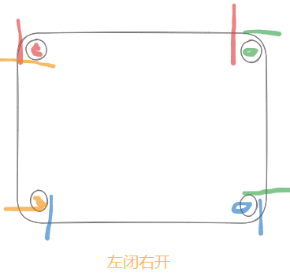
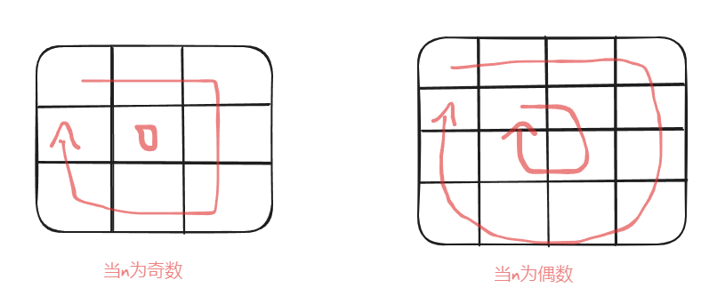
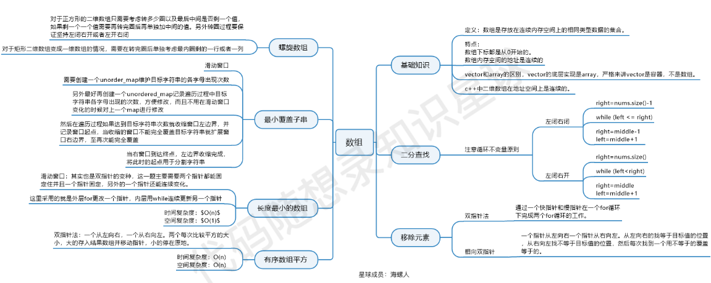

# 双指针

- 在双指针思想中，可以有两个read的指针，进行相应的条件判断，然后一个write指针，将符合条件的写入数组 。
- 同时数组，也可以是读写分别两个

# 滑动窗口

在本题中实现滑动窗口，主要确定如下三点：

- 窗口内是什么？
- 如何移动窗口的起始位置？
- 如何移动窗口的结束位置？

滑动窗口的起始和终止位置记录了一个状态，每一轮遇见符合的状态（所要的结果），需要将其按照需要进行保存。也就是说每一轮滑动窗口需要三个变量 i，j， status

# 练习

## 977 有序数组的平方

```c++
class Solution {
public:
    vector<int> sortedSquares(vector<int>& nums) {
        int len = nums.size();
        vector<int> arr(len, 0);
        int i = 0, j = len - 1, k = len -1;
        for(; k >= 0; k--){
            if(nums[i] * nums[i] > nums[j] * nums[j]){
                arr[k] = nums[i] * nums[i];
                i++;
            }else{
                arr[k] = nums[j] * nums[j];
                j--;
            }
        }
        return arr;
    }
};
```

## 209 长度最小的子数组

- INT32_MAX的头文件是<cstdint>，然后在这个文件中，找到了一些其他的定义

```c++
INT8_MIN
INT16_MIN
INT32_MIN
INT64_MIN

INT8_MAX
INT16_MAX
INT32_MAX
INT64_MAX
```

```c++
class Solution {
public:
    int minSubArrayLen(int target, vector<int>& nums) {
        int i = 0, j = 0, sum = 0;
        int minlen = INT32_MAX;
        for(; j < nums.size(); j++){
            sum += nums[j];
            while(sum >= target){
                int len = j - i + 1;
                minlen = min(minlen, len);
                sum -= nums[i++];
            }
        }
        return minlen == INT32_MAX? 0 : minlen;
    }
};
```

推荐题目

https://leetcode.cn/problems/fruit-into-baskets/description/

https://leetcode.cn/problems/minimum-window-substring/description/

## 59 螺旋矩阵

### 边界

对每一行（列）的边界处理要一样



### n的奇偶



可以观察到当n为奇数时，最后要处理的就是一个数字

```c++
class Solution {
public:
    vector<vector<int>> generateMatrix(int n) {
        int startX = 0, startY = 0, i =0, j = 0;
        int offset = 1;
        int count = 1;
        int loop = n / 2;
        vector<vector<int>> arr(n,vector<int>(n,0));
        // 对每一行（列）选择左闭右开
        
        // 循环次数为 n/2 因为每一圈会处理2行（列），n为边数
        while(loop--){
            //上行
            for(j = startY; j < n - offset; j++){
                arr[startX][j] = count++;
            }
            //右列
            for(i = startX; i <n - offset; i++){
                arr[i][j] = count++;
            }
            //下行
            for(; j > startY; j--){
                arr[i][j] = count++;
            }
            //左列
            for(; i > startX; i--){
                arr[i][startY] = count++;
            }
            startX++;
            startY++;
            offset++;
        }
        if(n % 2 != 0){
            arr[startX][startY] = count;
        }
        return arr;
    }
};
```

# 感想

做题顺序，都是先看题解，理解清楚明白后，自己独立写出来，出现bug也能调试出来

数组有几个很重要的点

- 注意每一轮此的边界
- 注意保存每一轮此需要保留的变量，可能是函数最终需要返回的值
- 双指针思想：多个读指针，一个写指针

