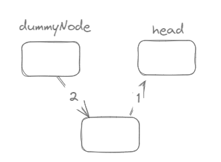
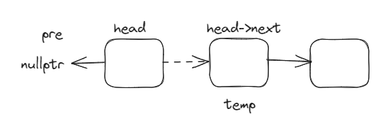

# 链表

## 链表元素

```c++
struct LinkNode{
    int val;
    LinkNode *next;
    LinkNode(int x):val(x),next(NULL) {}
};
```

## 移除链表元素

注意：不要使用头节点来遍历链表，不然，遍历完后，你怎么找到你的链表的头部呢？
所以，要定义一个临时的指针cur来遍历链表

## 边界

**cur的取值**

- `cur = dummyNode->next;`
- `cur = dummyNode;`

**就考虑特殊情况，当取第0个节点时，是否能得到想要的情况**

### 以获取第n个节点为例

```c++
cur = dummyNode->next;
while(n ){
    cur = cur->next;
    n--;
}
return cur;
//此时，若n=0，那么这个while循环就不会执行，应该直接return cur，那么此时cur=dummyNode->next
```

### 第n个节点前插入节点

```c++
cur = dummyNode;
while(n){
    cur = cur->next;
}

//此时，如果要在n=0前插入一个节点的话，我们需要cur指向-1位置，所以cur=dummyNode
```

### 删除第n个节点

```c++
cur = dummyNode;
while(n){
    
}
// 同理
```


# 练习

## 203 移除链表元素

### new delete

```c++
int *ptr = new int; // 分配一个整型变量的内存
delete ptr; // 释放 ptr 指向的内存
```

```c++
#include <iostream>

// 定义一个结构体
struct Person {
    std::string name;
    int age;
};

int main() {
    // 使用 new 分配一个 Person 结构体的内存
    Person *personPtr = new Person;

    // 对动态分配的结构体进行赋值
    personPtr->name = "John";
    personPtr->age = 30;

    // 打印动态分配的结构体的值
    std::cout << "Name: " << personPtr->name << ", Age: " << personPtr->age << std::endl;

    // 记得释放内存
    delete personPtr;

    return 0;
}
```

```c++
/**
 * Definition for singly-linked list.
 * struct ListNode {
 *     int val;
 *     ListNode *next;
 *     ListNode() : val(0), next(nullptr) {}
 *     ListNode(int x) : val(x), next(nullptr) {}
 *     ListNode(int x, ListNode *next) : val(x), next(next) {}
 * };
 */
class Solution {
public:
    ListNode* removeElements(ListNode* head, int val) {
        ListNode *dummyNode = new ListNode();
        dummyNode->next = head;
        // 因为要删除的是下一个cur->next
        ListNode *cur = dummyNode;
        while(cur->next != NULL){
            if(cur->next->val == val){
                cur->next = cur->next->next;
            }else{
                cur = cur->next;
            }
        }

        //注意返回的是dummNode->next，因为head可能被我们删除了
        return dummyNode->next;
    }
};
```

## 707 设计链表 

- 统一使用虚拟头节点`dummyNode`

- 注意链表赋值顺序

  虽然在头部插入节点时，可以先2再1，因为有head的存在，不会丢失边，但是这只特例在头部插入节点，当插入在链表中间位置时，会丢失修改

  

- 初始化一个链表：声明头节点；声明链表长度

### 构造函数

初始化类class的数据成员

### cur的确定

#### 对于更新操作

在链表中对于更新操作，我们都需要得到当前节点的前一个节点，也就是-1节点，所以cur=dummyNode

#### 对于读取操作

在链表中对于读取操作，都是对当前值进行操作，那么当我们要读0节点时，就是要读0节点，所以cur=dummyNode->next

```c++
class MyLinkedList {
public:
    // 由题意可选择但双链表，可知，节点数据结构并没有被定义
    struct LinkNode{
        int val;
        LinkNode *next;
        LinkNode(int x):val(x),next(nullptr){}
    };

    MyLinkedList() {
        _dummyNode = new LinkNode(0);
        _size = 0;
    }
    
    int get(int index) {
        if(index < 0 || index >= _size){
            return -1;
        }
        LinkNode *cur = _dummyNode->next;
        while(index > 0){
            cur = cur->next;
            index--;
        }
        return cur->val;
    }
    
    void addAtHead(int val) {
        LinkNode *node = new LinkNode(val);
        node->next = _dummyNode->next;
        _dummyNode->next = node;
        _size++;
    }
    
    void addAtTail(int val) {
        LinkNode *node = new LinkNode(val);
        LinkNode *cur = _dummyNode;
        while(cur->next != nullptr){
            cur = cur->next;
        }
        cur->next = node;
        _size++;
    }
    
    void addAtIndex(int index, int val) {
        if(index < 0 || index > _size){
            return;
        }
        LinkNode *node = new LinkNode(val);
        LinkNode *cur = _dummyNode;
        while(index > 0){
            cur = cur->next;
            index--;
        }
        node->next = cur->next;
        cur->next = node;
        _size++;
    }
    
    void deleteAtIndex(int index) {
        if(index < 0 || index >= _size){
            return;
        }
        LinkNode *cur = _dummyNode;
        while(index > 0){
            cur =cur->next;
            index--;
        }
        LinkNode *q = cur->next;
        cur->next = cur->next->next;
        delete q;
        _size--;
    }
private:
    LinkNode *_dummyNode;
    int _size;
};

/**
 * Your MyLinkedList object will be instantiated and called as such:
 * MyLinkedList* obj = new MyLinkedList();
 * int param_1 = obj->get(index);
 * obj->addAtHead(val);
 * obj->addAtTail(val);
 * obj->addAtIndex(index,val);
 * obj->deleteAtIndex(index);
 */
```

## 206 反转链表

### 头指针+头插法

需要创建一个虚拟头节点

```c++
/**
 * Definition for singly-linked list.
 * struct ListNode {
 *     int val;
 *     ListNode *next;
 *     ListNode() : val(0), next(nullptr) {}
 *     ListNode(int x) : val(x), next(nullptr) {}
 *     ListNode(int x, ListNode *next) : val(x), next(next) {}
 * };
 */
class Solution {
public:
    ListNode* reverseList(ListNode* head) {
        ListNode *dummyNode = new ListNode(0);
        dummyNode->next = head;
        ListNode *read = head;
        ListNode *write = dummyNode;
        
        // 很重要，否则会出现链表循环
        write->next = 0;
        while(read !=nullptr){
            // 临时指针，暂存 记录原链表的下一个节点
            ListNode *q = read->next;

            // 操作原链表的当前节点 到 新链表中去
            // 头插法
            read->next = write->next;
            write->next = read;

            read = q;
        }
        return dummyNode->next;
    }
};
```

### 双指针 + 原地反转



```c++
/**
 * Definition for singly-linked list.
 * struct ListNode {
 *     int val;
 *     ListNode *next;
 *     ListNode() : val(0), next(nullptr) {}
 *     ListNode(int x) : val(x), next(nullptr) {}
 *     ListNode(int x, ListNode *next) : val(x), next(next) {}
 * };
 */
class Solution {
public:
    ListNode* reverseList(ListNode* head) {
        ListNode *cur = head;
        // 因为第一轮head 反转的后指向的是nullptr
        ListNode *pre = nullptr;
        while(cur != nullptr){
            ListNode *temp = cur->next;
            // 改变方向
            cur->next = pre;
            // 整体后移一位，要准备进入下一轮循环
            pre = cur;
            cur = temp;
        }
        return pre;
    }
};
```

### 递归法

```c++
/**
 * Definition for singly-linked list.
 * struct ListNode {
 *     int val;
 *     ListNode *next;
 *     ListNode() : val(0), next(nullptr) {}
 *     ListNode(int x) : val(x), next(nullptr) {}
 *     ListNode(int x, ListNode *next) : val(x), next(next) {}
 * };
 */
class Solution {
public:
    ListNode* reverse(ListNode* cur,ListNode* pre){
        if(cur==nullptr){
            return pre;
        }
        ListNode* temp = cur->next;
        cur->next = pre;
        return reverse(temp,cur); 
    }
    ListNode* reverseList(ListNode* head) {
        return reverse(head,nullptr);
    }
};
```


# 感想

1. 在设计链表题中，最大的一个收获是：明白cur指针该如何赋值，对于更新操作，需要知道第n节点的前一个节点才能对链表的第n个位置进行操作，因此cur=dummyNode，对于读取操作，本身就是要读第n个节点，例如要操作第0个节点，那么cur=dummyNode->next
2. 在反转链表中，注意“双指针+原地反转”和“递归法”的对照，注意 “进入下一轮循环”和“下一层递归”的对应关系
3. 对于移除链表元素，注意返回的是dummNode->next，而不是最开始传入的head，因为head可能已经被我们删除了