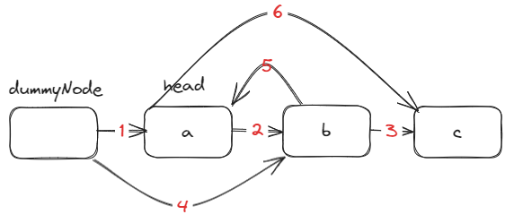
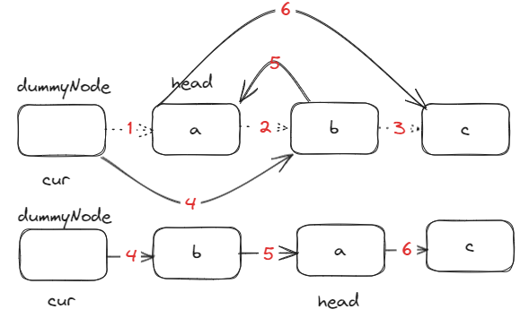
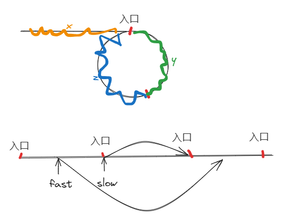

# 链表

## 修改指针导致 成环



### 问题起因

- 修改链表指针时，如果改变的是：后面的节点指向前面的节点，很容易成环，从而报错。
- 例如将节点b的指针3变为指针5指向节点a，那么a，b节点就成环了（由指针2、5）

### 解决方法

- 所以，我们应该从前往后修改指针指向，例如修改dummyNode的指针1变为指针4，
- 但这会导致一个问题：1指针丢失，节点a丢失。
- 所以需要使用临时节点保存节点a。

## cur指针最后如何更新

这个可以画图来确定cur指针如何更新



从这张图我们可以观察到

- head指针指向的仍是a，但a已经不是头节点了（因为dummyNode->next，a->next的内容改变了），所以我们最终返回的是dummyNode->next
- cur的最后一步迭代可以直接顺着图来数，cur指向a：cur=cur->next->next

# 练习

## 24 两两交换链表中的节点

```c++
/**
 * Definition for singly-linked list.
 * struct ListNode {
 *     int val;
 *     ListNode *next;
 *     ListNode() : val(0), next(nullptr) {}
 *     ListNode(int x) : val(x), next(nullptr) {}
 *     ListNode(int x, ListNode *next) : val(x), next(next) {}
 * };
 */
class Solution {
public:
    ListNode* swapPairs(ListNode* head) {
        ListNode *dummyNode = new ListNode(0);
        dummyNode->next = head;
        ListNode *cur = dummyNode;
        while(cur->next!=nullptr && cur->next->next!=nullptr){
            ListNode *temp = cur->next;
            ListNode *temp1 = cur->next->next->next;
            cur->next = cur->next->next;
            temp->next = temp->next->next;
            cur->next->next = temp;
            cur = cur->next->next;
        }
        return dummyNode->next;
    }
};
```

## 19 删除链表的倒数第N个节点

画图构思

```c++
/**
 * Definition for singly-linked list.
 * struct ListNode {
 *     int val;
 *     ListNode *next;
 *     ListNode() : val(0), next(nullptr) {}
 *     ListNode(int x) : val(x), next(nullptr) {}
 *     ListNode(int x, ListNode *next) : val(x), next(next) {}
 * };
 */
class Solution {
public:
    ListNode* removeNthFromEnd(ListNode* head, int n) {
        ListNode *dummyNode = new ListNode(0);
        dummyNode->next = head;
        ListNode *fast = dummyNode;
        ListNode *slow = dummyNode;

        // 使用双指针确定倒数第n个位置

        while(n--){
            fast = fast->next;
        }

        // 边界确定：考虑只有head和没有head（即空链表）的情况
        // 因为dummyNode是new出来的一定存在，即初始状态head一定存在
        // 所以只需要在第一轮只需要考虑dummyNode->next情况
        // 即在每一轮只需要考虑fast->next的情况
        // 当fast->next=nullptr时，slow指向倒数第n+1节点
        while(fast->next != nullptr){
            fast = fast->next;
            slow = slow->next;
        }
        ListNode *q = slow->next;
        slow->next = slow->next->next;
        delete q;
        return dummyNode->next;
    }
};
```

## 02.07 链表相交

链表：画图构思

```c++
/**
 * Definition for singly-linked list.
 * struct ListNode {
 *     int val;
 *     ListNode *next;
 *     ListNode(int x) : val(x), next(NULL) {}
 * };
 */
class Solution {
public:
    ListNode *getIntersectionNode(ListNode *headA, ListNode *headB) {
        // 这是读取行为，所以cur直接取head值
        ListNode *curA = headA;
        ListNode *curB = headB;
        int lenA=0, lenB=0;

        // 考虑headA=nullptr情况。从而确定边界问题
        while(curA != nullptr){
            lenA++;
            curA = curA->next;
        }
        while(curB != nullptr){
            lenB++;
            curB = curB->next;
        }

        curA = headA;
        curB = headB;
        
        // 将lenA确定为长链表
        if(lenB > lenA){
            swap(lenA,lenB);
            swap(curA,curB);
        }

        // 使curA和curB指向的链表长度一致
        int gap = lenA - lenB;
        while(gap--){
            curA = curA->next;
        }

        while(curA != nullptr && curB !=nullptr){
            if(curA == curB){
                return curA;
            }
            curA = curA->next;
            curB = curB->next;
        }
        return NULL;
    }
};
```

## 142 环形链表 

### slow在一圈内一定被追到

**阶段模拟法**




> 因为绕圈问题本身是循环问题，fast、slow可能同时存在于上下两个循环阶段，则我们可以将每一个循环阶段如图 线条 展开，模拟每一圈的情况。且认为fast是前一阶段更容易理解。
>
> 这是一种思想，但我还是不能从这里面理解，下面使用另一种方式解释（极限情况）。
>
> 假设，slow、fast最初相对距离最远为n-1，即fast在slow前面一步，由于fast = fast->next->next,slow=slow->next。fast用一步的距离向slow接近，相对世界中：slow静止不动，那么fast需要走n-1个时间，绝对世界中：slow走n-1个时间被追上，即slow没有走完一圈（只差一步走完一圈被追上）

```c++
/**
 * Definition for singly-linked list.
 * struct ListNode {
 *     int val;
 *     ListNode *next;
 *     ListNode(int x) : val(x), next(NULL) {}
 * };
 */
class Solution {
public:
    ListNode *detectCycle(ListNode *head) {
        // 链表读取操作
        ListNode *fast = head;
        ListNode *slow = head;
        ListNode *index1;
        ListNode *index2;

        // 边界判断，head=nullptr
        while(fast != nullptr && fast->next !=nullptr){
            fast = fast->next->next;
            slow = slow->next;
            if(fast == slow){
                index1=fast;
                index2=head;
                while(index1 != index2){
                    index1 = index1->next;
                    index2 = index2->next;
                }
                return index1;
            }
        }
        return NULL;
    }
};
```

# 感想

1. 从两两交换指针中，感悟最深的一点就是，要意识到head指针指向节点，和节点中next指针，这两个指针的区别，head指针指向的是一种**绝对路径**，意味着，我使用head指针访问的一定是val这个节点，而节点中包含的next指针一种**相对路径**，意思是我使用这个指针访问的是相对于该节点的下一个节点（强调在链表中的顺序问题）