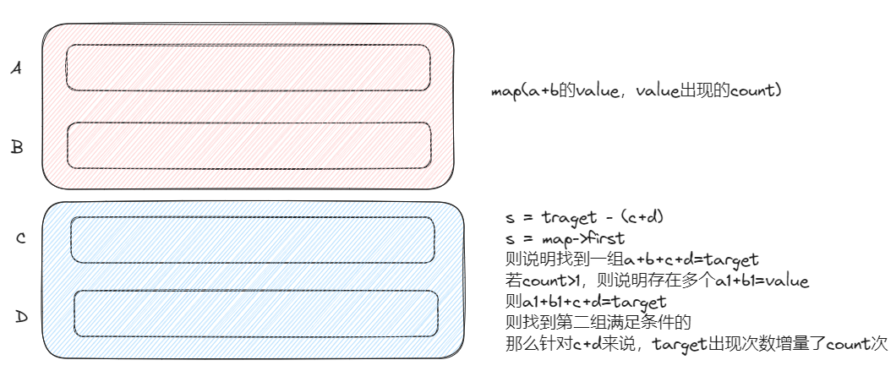
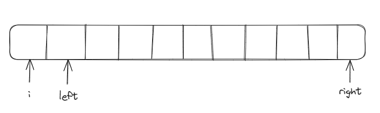
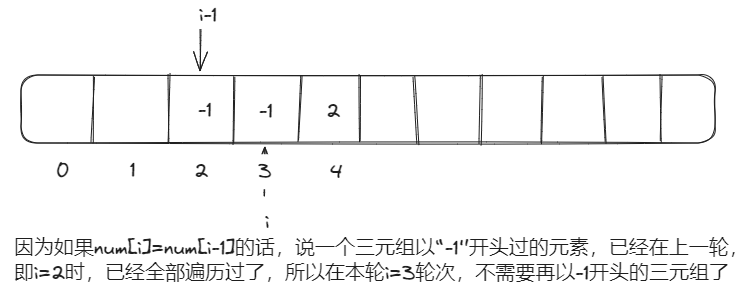

# 数组求和

## hashTable




- 将数组平均分，降低时间复杂度，例如这里的时间复杂度只有n的平方
- 对大组1，进行建hashTable操作，由于又要保存a+b的value值，又要存储value出现的次数，所以使用map
- 对大组2，就是查找操作，针对s=target-(c+d)，找hashTable中有没有a+b=s，如果有，则说明找到符合条件的四元组

## 双指针

- 要求去重
- 如果对一个数组中的元素求和，可以使用双指针法
- 注意，使用双指针一定要记得对数组进行排序



- ```c++
  if(num[i]+num[left]+num[right] > traget){
      right--;
  }else if(num[i]+num[left]+num[right] < traget){
      left++;
  }
  ```

  

# 练习

## 454 四数相加

```c++
class Solution {
public:
    int fourSumCount(vector<int>& nums1, vector<int>& nums2, vector<int>& nums3, vector<int>& nums4) {
        int count = 0;
        unordered_map<int,int> hashTable;
        for(auto i : nums1){
            for(auto j : nums2){
                hashTable[i+j]++;
            }
        }

        for(auto k : nums3){
            for(auto h : nums4){
                int s = 0-(k+h);
                auto iter = hashTable.find(s);
                if(iter != hashTable.end()){
                    count += iter->second;
                }
            }
        }
        return count;
    }
};
```

## 383 赎金信

```c++
class Solution {
public:
    bool canConstruct(string ransomNote, string magazine) {
        int hashTable[26]={0};
        for(int i = 0; i < magazine.size(); i++){
            hashTable[magazine[i] - 'a']++;
        }
        for(int j = 0; j < ransomNote.size(); j++){
            if(hashTable[ransomNote[j] - 'a'] == 0){
                return false;
            }
            hashTable[ransomNote[j] - 'a']--;
        }
        return true;
    }
};
```

## 15 三树之和

**注意**



```c++
num[i] = num[i+1];
num[i] = num[i-1];
//注意 这里应该使用num[i-1]，因为，left在i的前面，如果直接判断i和i+1的话，就会漏掉{-1，-1，2}这种符合条件的例子
```

```c++
class Solution {
public:
    vector<vector<int>> threeSum(vector<int>& nums) {
        vector<vector<int>> result;
        sort(nums.begin(),nums.end());
        for(int i =0; i < nums.size() - 2; i++){
            // 剪枝
            if(nums[i] > 0) break;
            if(i > 0 && nums[i] == nums[i-1]) continue;
            int left = i + 1;
            int right = nums.size() - 1;
            while(right > left){//判断能不能取等号
                if(nums[i] + nums[left] + nums[right] > 0){
                    right--;
                }else if(nums[i] + nums[left] + nums[right] < 0){
                    left++;
                }else{
                    while(right > left && nums[right]==nums[right - 1]) right--;
                    while(right > left && nums[left]==nums[left + 1]) left++;
                    result.push_back({nums[i],nums[left],nums[right]});
                    right--;
                    left++;
                }
            }
        }
        return result;
    }
};
```

## 18 四数之和

**注意**

因为这里target可以小于0，所以直接做剪枝是不合适的，因为{k,i,left,right}={-4，-1，0，0}，target=-5，这里k=-4>traget,不能直接剪枝，因为负数+负数的和会变小

```c++
// 剪枝
if(nums[k] > target && nums[k] > 0 && target > 0) break;
// 去重
if(k > 0 && nums[k]==nums[k-1]) continue;

// 二级剪枝
if(nums[k]+nums[i] > target && nums[k] + nums[i] > 0 && target > 0) break;
// 二级去重
if(i > k+1 && nums[i]==nums[i-1]) continue;
```

和三数之和的逻辑是一样的，增加了剪枝和去重的层次

```c++
class Solution {
public:
    vector<vector<int>> fourSum(vector<int>& nums, int target) {
        vector<vector<int>> result;
        // 双指针法条件：数组有序
        sort(nums.begin(),nums.end());
        for(int k = 0; k < nums.size(); k++){
            // 因为target可能为负数，所以剪枝需要有条件，限制target>0时，才能进行剪枝
            if(nums[k] > target && nums[k] >= 0) break;
            if(k > 0 && nums[k]==nums[k-1]) continue;
            for(int i = k + 1; i < nums.size(); i++){
                // 二级剪枝
                if(nums[k] + nums[i] > target && nums[k] + nums[i] >= 0) break;
                if(i > k+1 && nums[i]==nums[i-1]) continue;
                int left = i + 1;
                int right = nums.size() - 1;
                while(right > left){
                    if((long)nums[k] + nums[i] + nums[left] + nums[right] > target){
                        right--;
                    }else if((long)nums[k] + nums[i] + nums[left] + nums[right] < target){
                        left++;
                    }else{
                        while(right > left && nums[right]==nums[right - 1]) right--;
                        while(right > left && nums[left]==nums[left + 1]) left++;
                        result.push_back({nums[k],nums[i],nums[left],nums[right]});
                        right--;
                        left++;
                    }
                }
            }
        }
        return result;
    }
};
```

# 感想

- 数组求和有两种方式，一种是使用hashTable一种是使用双指针的方法。

- 注意 vector.size()是无符号整数，vector.size()-3会变成一个很大的值。所以对于for循环中想要缩短边界可以这样子处理

  ```c++
  int n = vector.size();
  for(int k = 0; k < n - 3; k++){
  }
  ```

  