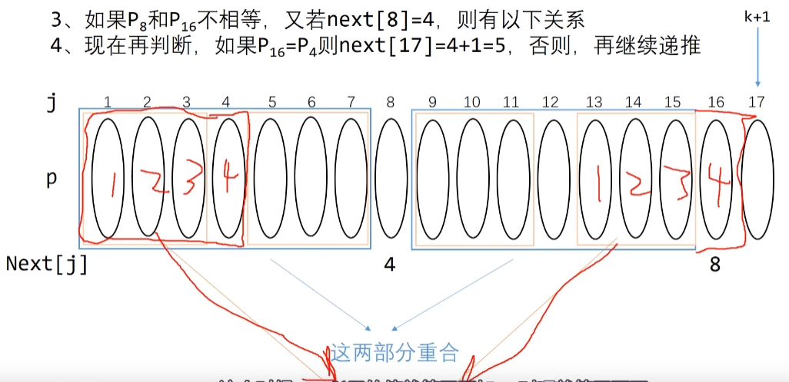
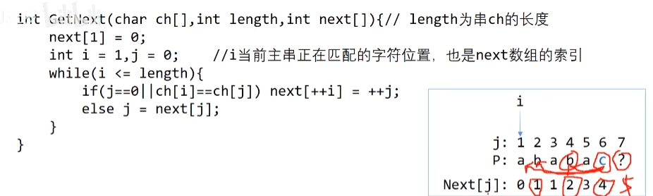

# KMP算法

链接：https://www.bilibili.com/video/BV16X4y137qw/?buvid=YA4D78A88E247CCA4BCC91E1FAD864107243&from_spmid=search.search-result.0.0&is_story_h5=false&mid=E381cXDNAt7CJ4Wgzaq6UQ%3D%3D&p=1&plat_id=122&share_from=ugc&share_medium=iphone&share_plat=ios&share_session_id=C9090899-0179-43BD-A472-5679761344B4&share_source=WEIXIN&share_source=weixin&share_tag=s_i&spmid=united.player-video-detail.0.0&timestamp=1714187386&unique_k=ZeR7j6W&up_id=246785213&vd_source=dc9bc617b66986943388a30c7ef1c9c1





所以要更新next[17]的值其实就是比较next[16]和next[8]，如果匹配则等于8+1=9，如果不匹配，则j=next[j]，比较next[16]和next[4]的值，如果匹配则等于4+1=5（这里4说明有1、2、3、4相匹配

```
// 所以其实很好理解
// 分为两种情况，一种是匹配上了，一种是没匹配上
匹配上了
在这里意思是我正在匹配i，但i具体是什么字符我根本不关心，我关心的是i之前的字符串的前后缀重合情况
则next[i] = 重合的字符个数 + 1
没匹配上
则 j 应该回退到，（如果在k位置没有匹配上，其实就是前缀j 和 后缀i，没有匹配上，其实在初始化next数组的过程中，也可以将j看成模式串的，i看成文本串的）
则 j = next[k - 1]的值，即j值等没有没有匹配上的字符的前一个字符k-1的next值
```

但有时候要注意，next表达的含义是计算包含当前字符的前后缀相等情况（b站链接），还是不包含当前字符的（代码随想录）

```c++
//代码随想录
class Solution {
public:
    void getNext(int* next, const string& s) {
        int j = 0;
        next[0] = 0;
        for(int i = 1; i < s.size(); i++) {
            while (j > 0 && s[i] != s[j]) {
                j = next[j - 1];
            }
            if (s[i] == s[j]) {
                j++;
            }
            next[i] = j;
        }
    }
    int strStr(string haystack, string needle) {
        if (needle.size() == 0) {
            return 0;
        }
        vector<int> next(needle.size());
        getNext(&next[0], needle);
        int j = 0;
        for (int i = 0; i < haystack.size(); i++) {
            while(j > 0 && haystack[i] != needle[j]) {
                j = next[j - 1];
            }
            if (haystack[i] == needle[j]) {
                j++;
            }
            if (j == needle.size() ) {
                return (i - needle.size() + 1);
            }
        }
        return -1;
    }
};
```

# 练习

## 28 找出字符串中第一个匹配项

```c++
class Solution {
public:
    // 做这道题前，要确定好如下几点
    /*
    1、数组下标从多少开始，则决定了next[0]开始还是next[1]开始
    2、next数组，包含当前字符的前后缀重合
    */
    
    void getNext(int* next, const string& s){
        int j = 0;
        int i = 1;
        next[0] = 0;
        for( ; i < s.size(); i++){
            // 匹配不上
            while(j > 0 && s[i] != s[j]) j = next[j-1];

            //匹配上了
            if(s[i] == s[j]) j++;
            /*
            有两种情况 j=0
            1、第一次进入时，判断前面两个字符（且这两个字符不相等），在匹配时，说明当模式串
            的第三个匹配不上时，应该回到模式串的首字符，首字符再与文本串的不匹配的匹配
            2、匹配不上，且匹配不上的字符前面的所有字符的前后缀不重合，要回到模式串首位
            */
            next[i] = j; 
        }
    }
    int strStr(string haystack, string needle) {
        if(needle.size() == 0){
            return -1;
        }
        vector<int> next(needle.size());
        getNext(&next[0],needle);
        int j = 0;
        for(int i = 0; i < haystack.size(); i++){
            while(j > 0 && haystack[i] != needle[j]) j = next[j - 1];
            if(haystack[i] == needle[j]) j++;
            if(j == needle.size()){
                return (i - needle.size() + 1);
            }
        }
        return -1;
    }
};
```

## 459 重复的子字符串

```c++
class Solution {
public:
    // 前缀表不减1
    // 下标从0开始
    void getNext(int *next, string &s){
        int j = 0;
        int i = 1;
        next[0] = 0;
        for(; i < s.size(); i++){
            while(j > 0 && s[i] != s[j]) j = next[j-1];
            if(s[i] == s[j]) j++;
            next[i] = j;
        }
    }
    bool repeatedSubstringPattern(string s) {
        if(s.size() == 0){
            return false;
        }
        vector<int> next(s.size());
        getNext(&next[0],s);
        if(next[s.size() - 1] != 0 && (s.size() % (s.size() - next[s.size() - 1]))==0){
            return true;
        }
        return false;
    }
};
```

