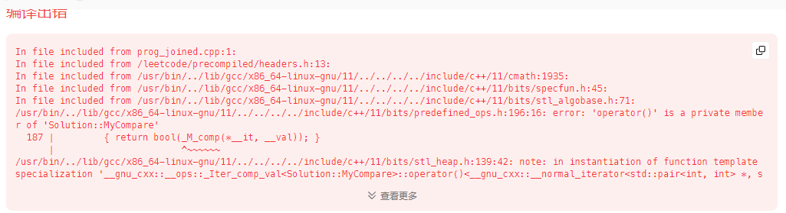

# priority_queue

传入less，建成小根堆，传入greater，建成大根堆

## 源码解析

### std::less

```c++
struct less : public binary_function<_Tp, _Tp, bool>
{
    _GLIBCXX14_CONSTEXPR
    bool
    operator()(const _Tp& __x, const _Tp& __y) const
    { return __x < __y; }
};
```

排序函数comp(a,b)，返回一个bool值，可以把其中的`a`看作序列中前一个位置的元素，`b`看作后一个位置的元素，当返回值为`true`时不改变元素顺序，反之则需要调换元素。

### __push_heap

```c++
__push_heap(_RandomAccessIterator __first, _Distance __holeIndex,
            _Distance __topIndex, _Tp __value, _Compare __comp)
    //__holeIndex  新添加节点的索引，即叫做孔洞
    //__topIndex  顶端索引
    //__value   新添加节点的值
    //__comp    比较函数，传入为less
{
  _Distance __parent = (__holeIndex - 1) / 2;   //找到新节点父节点索引
  while (__holeIndex > __topIndex && __comp(*(__first + __parent), __value)) {
      //若孔洞没有到达最顶端  &&  父节点的值小于新添加节点的值，则要进行下列操作
      //less中，左边比右边小则返回true，与less愿意相同
    *(__first + __holeIndex) = *(__first + __parent);   //将父节点的值放入孔洞
    __holeIndex = __parent; //孔洞的索引编程了原来父节点的索引，往上移动了
    __parent = (__holeIndex - 1) / 2;   //那么孔洞的父节点又要继续往上找，孔洞继续上移
  }
  *(__first + __holeIndex) = __value; //将新添加节点的值放在找到的位置（孔洞）
}
```

经过上面源码分析，传入的`comp`就是为了在比较孔洞节点与父节点的大小，若返回true，才会进行交换操作。

所以传入`less`，返回true是因为父节点比孔洞节点小，所以要进行交换，则将大的值移动到前面，所以建成的堆为大顶堆。

而传入`greater`，返回true是因为父节点比孔洞节点答，所以进行叫喊，则将大的值移动到了后面，所以建成的堆为小顶堆。

所以，就明白了为什么传入`less`反而形成了大根堆，而传入`greater`则形成了小根堆。

# 练习

## 239 滑动窗口最大值

```c++
class Solution {
    // 实现一个队列，该队列保存当前窗口可能成为最大的值，每一轮窗口结束时，将其弹出，弹出的值为所求
private:
    class Myqueue{
    private:
        deque<int> que;
    public:
        // 当队列不为空，且此时的value和要que.top()
        // pop使用在当k=3时，上一轮滑动窗口的最大值，已经不在下一轮的滑动窗口中，但又因为是最大值，
        // 所以push函数无法将其剔除，只能使用一个专门的pop函数来操作
        void pop(int value){
            if(!que.empty() && value == que.front()){
                que.pop_front();
            }
        }

        // 如果value大于que.back，则弹出元素，直到队列为空或者队列已经存在的元素大于value
        void push(int value){
            while(!que.empty() && value > que.back()){
                que.pop_back();
            }
            que.push_back(value);
        }
        int front(){
            return que.front();
        }
    };
public:
    vector<int> maxSlidingWindow(vector<int>& nums, int k) {
        Myqueue que;
        vector<int> result;
        for(int i = 0; i < k; i++){
            que.push(nums[i]);
        }
        result.push_back(que.front());
        for(int i = k; i < nums.size(); i++){
            que.pop(nums[i-k]);
            que.push(nums[i]);
            result.push_back(que.front());
        }
        return result;
    }
};
```

## 347 前k个高频元素

```c++
class Solution {
private:
    // 构建小根堆，则需要传入greater（递减）
    class MyCompare{
    // 注意这里 public 不能少，否则会报编译错误
    public:
        bool operator()(const pair<int,int>& lcp, const pair<int,int>& rcp){
            // 先设定lcp 在 rcp前面，即直接要求返回true
            // 实现递减序列，则lcp > rcp
            return lcp.second > rcp.second;
        }
    };
public:
    vector<int> topKFrequent(vector<int>& nums, int k) {
        unordered_map<int,int> mp;
        for(int i = 0; i < nums.size(); i++){
            mp[nums[i]]++;
        }
        priority_queue<pair<int,int>, vector<pair<int,int>>, MyCompare> pri_que;
        for(unordered_map<int,int>::iterator it = mp.begin(); it != mp.end(); it++){
            pri_que.push(*it);
            if(pri_que.size() > k){
                pri_que.pop();
            }
        }
        vector<int> result(k);
        for(int i = k - 1; i >= 0; i--){
            result[i] = pri_que.top().first;
            pri_que.pop();
        }
        return result;
    }
};
```

### class 访问级别编译错误



`MyCompare` 是一个嵌套类，它重载了 `operator()`，用于定义优先队列 `pri_que` 中元素的比较方式。然而，问题出在 `operator()` 函数的可访问性上。

在类中，默认情况下，成员函数和成员变量的访问级别是 `private`，所以在 `MyCompare` 类中，默认情况下，`operator()` 函数也是 `private` 的，即它只能在类的内部访问，而不能从外部访问。因此，当你尝试在 `Solution` 类的成员函数中使用 `MyCompare` 类时，它无法访问 `MyCompare` 类的 `operator()` 函数，从而导致编译错误。

要解决这个问题，你需要显式将 `operator()` 函数声明为 `public`。修改 `MyCompare` 类如下：

```c++
class MyCompare {
public:
    bool operator()(const pair<int, int>& lcp, const pair<int, int>& rcp) {
        return lcp.second > rcp.second;
    }
};
```

这样做可以确保 `operator()` 函数对外可见，可以在 `Solution` 类的成员函数中正确使用。

# 感想

1. 关于容器的使用，容器底层的实现，c++语法
2. 注意class 访问级别编译错误