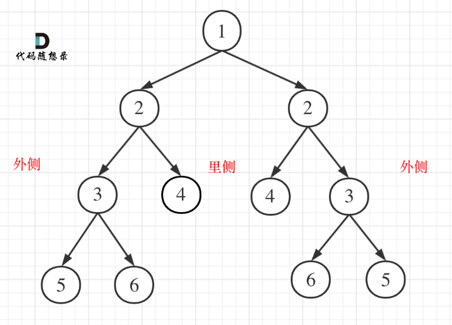

# 二叉树

## 层序遍历-迭代法

```c++
struct TreeNode{
    int val;
    TreeNode* left;
    TreeNode* right;
    TreeNode():val(0),left(nullptr),right(nullptr) {}
  	TreeNode(int x):val(x),left(nullptr),right(nullptr) {}
    TreeNode(int x, TreeNode* lp, TreeNode* rp):val(x),left(lp),right(rp) {}
};

class Solution{
public:
    vector<vector<int>> levelOrder(TreeNode* root){
        queue<TreeNode*> que;
        if(root != nullptr) que.push(root);
        vector<vector<int>> result;
        while(!que.empty()){
            int size = que.size();
            //size作为快照，记录当前层次的数据个数,因为到后面push(node->left)会出现不同层节点都在队列
            vector<int> vec;
            for(int i = 0; i < size; i++){
                TreeNode* node = que.front();
                que.pop();
                vec.push_back(node->val);
                if(node->left) que.push(node->left);
                if(node->left) que.push(node->right);
            }
            result.push_back(vec);
        }
        return result;
    }
}
```

```c++
class Solution{
public:
    vector<vector<int>> levelOrder(TreeNode* root){
        queue<TreeNode*> que;
        if(root != nullptr) que.push(root);
        vector<vector<int>> result;
        while(!que.empty()){
            int size = que.size();
            vector<int> vec;
            for(int i = 0; i < size(); i++){
                TreeNode* node = que.front();
                que.pop();
                vec.push_back(node->val);
                if(node->left) que.push(node->left);
                if(node->right) que.push(node->right);
            }
            result.push_back(vec);
        }
        return result;
    }
}
```

## 翻转

### 递归

```c++
struct TreeNode{
    int val;
    TreeNode* left;
    TreeNode* right;
    TreeNode():val(0), left(nullptr), right(nullptr) {}
    TreeNode(int x):val(x), left(nullptr), right(nullptr) {}
    TreeNode(int x, TreeNode* lp, TreeNode* rp):val(x),left(lp), riht(rp) {}
};
class Solution{
    //前序
    TreeNode* invertTree(TreeNode* root){
        //递归终止条件
        if(root == nullptr) return root;
        swap(root->left,root->right);//中
        invertTree(root->left);//左
        invertTree(root->right);//右
        return root;
    }
}
```

### 迭代

```c++
class Solution{
    TreeNode* invertTree(TreeNode* root){
        if(root == nullptr) return root;
        stack<TreeNode*> st;
        st.push(root);
        while(!st.empty()){
            TreeNode* node = st.top();
            st.pop();
            swap(node->left,node->right);
            if(node->right) st.push(node->right);
            if(node->left) st.push(node->left);
        }
        return root;
    }
}
```

## 对称

只能使用后序，左右 中，则可以先处理左右，将孩子信息传回 父亲（中）

两棵二叉树同时进行比较



```c++
class Solution {
public:
    bool compareTree(TreeNode* left, TreeNode* right){
        if(left == nullptr && right != nullptr) return false;
        else if(left != nullptr && right == nullptr) return false;
        else if(left == nullptr && right == nullptr) return true;
        else if(left->val != right->val) return false;
        //后序
        bool outside = compareTree(left->left, right->right);//外侧
        bool inside = compareTree(left->right, right->left);//内侧
        return outside && inside;
    }
    bool isSymmetric(TreeNode* root) {
        if(root == nullptr) return true;
        return compareTree(root->left, root->right);
    }
};
```

