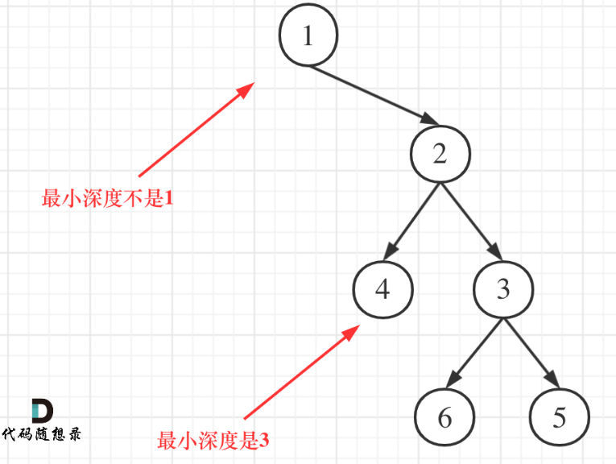
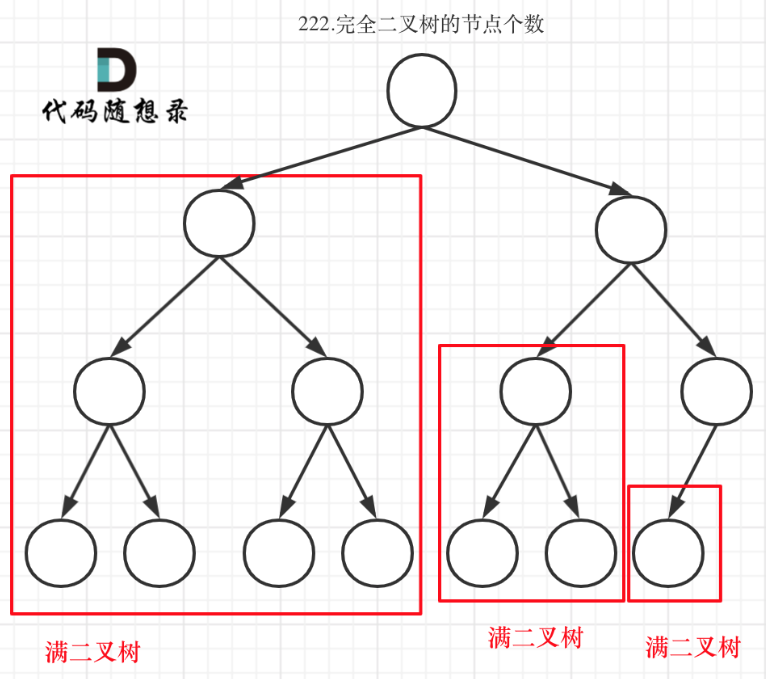
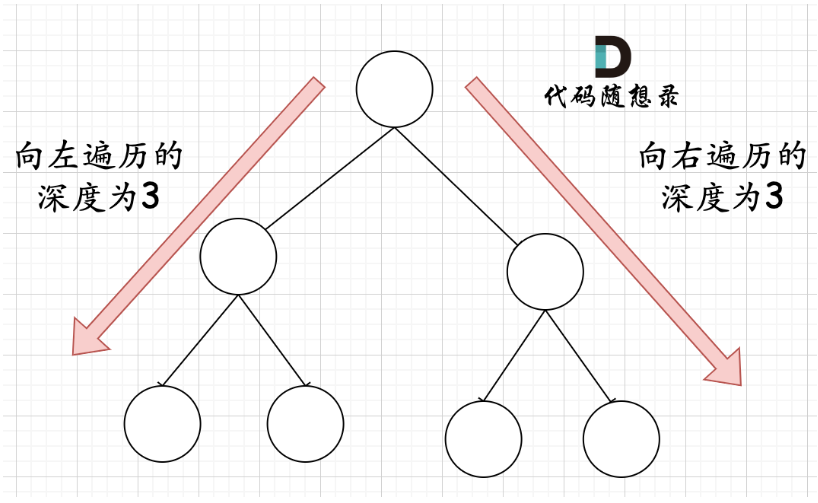
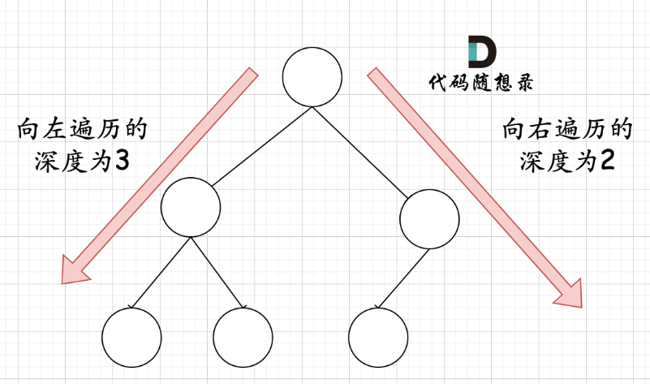

# 高度与深度

高度：后序遍历。将孩子节点的高度返回给父节点（中），父节点来处理逻辑（高度加1）。最下层的为1 

深度：前序遍历，从上往下，中（深度加1）

为什么二叉树的最大深度可以用后序遍历来求呢？是因为求的是二叉树根节点的高度，这两个值是一样的。

```c++
//104 求树的最大深度
class Solution {
public:
    //后序遍历
    int getDepth(TreeNode* node){
        if(node == nullptr) return 0;
        int leftDepth = getDepth(node->left);//左
        int rightDepth = getDepth(node->right);//右
        int result = 1 + std::max(leftDepth, rightDepth);//中
        return result;
    }
    int maxDepth(TreeNode* root) {
        return getDepth(root);
    }
};
```

## 递归结构

递归参数

```c++
int getDepth(TreeNode* node){
```

递归出口

```c++
if(node == nullptr) return 0;
```

递归方式

```c++
int leftDepth = getDepth(node->left);//左
int rightDepth = getDepth(node->right);
int result = 1 + std::max(leftDepth, rightDepth);//中
```

一轮处理完要返回

```c++
return result;
```

# 作业

## 111 二叉树的最小深度

注意：最小深度是指根节点到**叶子节点**的最小距离



```c++
class Solution {
public:
    //后序遍历
    int getDepth(TreeNode* node){
        if(node == nullptr) return 0;
        int leftDepth = getDepth(node->left);
        int rightDepth = getDepth(node->right);
        // 孩子节点返回后，继续执行
        //中 处理方式和求max不同了
        if(node->left == nullptr && node->right != nullptr)
            return 1 + rightDepth;
        if(node->left != nullptr && node->right == nullptr)
            return 1 + leftDepth;
        int result = 1 + std::min(leftDepth, rightDepth);
        return result;
    }
    int minDepth(TreeNode* root) {
        return getDepth(root);
    }
};
```

## 222 完全二叉树节点数量

### 普通二叉树

时间复杂度O(n)

```c++
class Solution {
public:
    //递归 后序遍历，目的是将孩子节点信息返回给父节点
    int getNodesNum(TreeNode* node){
        //递归出口
        if(node == nullptr) return 0;
        
        //递归主体
        int leftNode = getNodesNum(node->left);//左
        int rightNode = getNodesNum(node->right);//右
        int result = leftNode + rightNode + 1;//中

        //本层逻辑返回
        return result;
    }
    int countNodes(TreeNode* root) {
        return getNodesNum(root);
    }
};
```

### 完全二叉树

满二叉树：2^树深度 - 1 来计算，注意这里根节点深度为1



在完全二叉树中，如果递归向左遍历的深度等于递归向右遍历的深度，那说明就是满二叉树



在完全二叉树中，如果递归向左遍历的深度不等于递归向右遍历的深度，则说明不是满二叉树



```c++
class Solution {
public:
    int countNodes(TreeNode* root) {
        //递归出口
        if(root == nullptr) return 0;
        TreeNode* left = root->left;
        TreeNode* right = root->right;
        int leftDepth = 0, rightDepth = 0;
        while(left){
            left = left->left;
            leftDepth++;
        }
        while(right){
            right = right->right;
            rightDepth++;
        }

        //递归主体
        int leftNode = countNodes(root->left);//左
        int rightNode = countNodes(root->right);//右
        
        //中 分情况讨论，如果是满子树的根节点
        if(leftDepth == rightDepth)
            return (2 << leftDepth) - 1;//(2<<1 = 2*2 = 4)

        //中 如果不是满子树
        int result = leftNode + rightNode + 1;

        //当前递归层 返回
        return result;
    }
};
```

- 时间复杂度：O(log n × log n)
- 空间复杂度：O(log n)